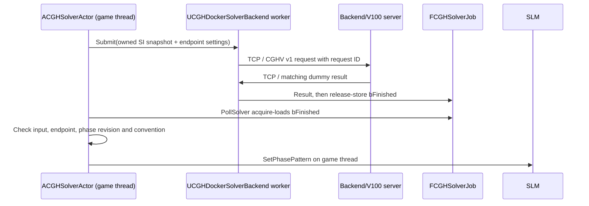

# Docker/TCP backend — phase 1

`UCGHDockerSolverBackend` is the second implementation of `UCGHSolverBackend`. It serializes an owned solver snapshot, communicates asynchronously over TCP, and receives an `FCGHSolverResult`. `Backend/V100` contains an independent Linux C++ server, a CMake build, and a Dockerfile. The server and shared wire contract use no Unreal Engine headers or libraries.

**The server returns a deterministic dummy phase pattern. It does not implement PointFocus, CUDA, or any optical algorithm.** `UCGHCPUSolverBackend` and the numerical implementation in `CGHPointFocus` are unchanged. Select CPU for a physical reference calculation.



## Build and run

Use the standalone [server instructions](../Backend/V100/README.md) for CMake, CTest, Docker image build, and port publishing. The default service port is **7000**. A V100, NVIDIA runtime, CUDA SDK, and Unreal installation are not required to build or run this phase.

Build `CGHSimEditor` normally after adding the C++ files. The runtime module depends on `Sockets` and `Networking`; its private include path points to `Backend/V100/include`. This is an engine-independent protocol dependency, not a dependency on the server executable.

In Unreal:

1. Add/select **CGH Solver Actor** and assign its **Workbench**. Keep a valid SLM, PlaneWave light, and at least one valid Point or Mesh target, as for the CPU workflow.
2. Select **Parameters → Solver Backend → Docker (TCP dummy)**.
3. Set **Parameters → Docker → Address** to the server's numeric IPv4 address and **Port** to the published host port. Defaults are `127.0.0.1:7000`. DNS names are not supported in phase 1.
4. Set **Connect Timeout Seconds** and **Request Timeout Seconds** as needed (defaults 5 and 30 seconds). The request timeout includes serialization, connection, transfer, decoding, and conversion. No reconnect or automatic retry is performed within a job.
5. Click **Generate Phase Pattern**. Status moves through Queued/Running to Ready; the Ready text explicitly identifies the result as a dummy. Select the SLM to view the received pattern.
6. Cancel during a request to retain the last accepted phase. Change back to CPU and generate to run the reference solver.

The Docker phase-1 limit is 16,777,216 pixels, at most 16,384 per axis, and 1,000,000 aggregate point/mesh samples. These transport limits do not change CPU limits. Each frame is limited to 256 MiB. Large grids require corresponding input, wire, result, and preview buffers; begin with the default 256×256 SLM.

## Ownership and lifecycle

Submission copies endpoint settings and the immutable scene/cloud snapshot into a job worker. Network I/O, serialization, and decoding happen off the game thread. The worker captures no actor or backend UObject and closes its socket when it completes. Only that worker writes `Result`; it release-stores `bFinished` afterwards. `PollSolver` acquire-loads completion before reading the result.

The actor retains its existing one-active/one-latest-pending policy. Replacing a request cancels the old worker before launching the replacement. Cancel, EndPlay, actor destruction, and failed or stale requests leave the previously accepted SLM phase intact. The game thread never joins or waits for the network worker. Endpoint changes and changes to transmitted scene fields invalidate Docker results; CPU consumed-input comparisons retain their prior semantics.

Each connection carries one request. A matching Cancel frame can be sent after the request has been completely transmitted; disconnect is authoritative cancellation at any point, including a partial request. Cancellation suppresses publication even when it races with a complete response. A cancelled or failed job contains no partial phase pattern. Socket operations use bounded waits and handle fragmented reads/writes; deadlines also cover a peer that stalls or disconnects.

The client checks version, type, request ID, lengths, dimensions, result status, propagation convention, finite compute time, and every phase sample before a result is eligible for SLM publication. The server validates the portable snapshot and reports protocol errors. No Unreal object layout, enum ordinal, pointer, or `FArchive` representation is sent over TCP.

## Wire protocol and CUDA extension

See [the versioned wire specification](../Backend/V100/PROTOCOL.md) and the shared header in `Backend/V100/include/cgh/wire.hpp` for exact field order, units, type IDs, byte order, errors, and dummy pattern definition. Positions/pitches use meters, phase uses radians, and the propagation convention is explicit. Full binary64 values preserve optical precision; mesh clouds preserve identity, revision, target-local positions, normals, sample amplitude/phase, and UVs.

Phase storage remains `PhaseRad[row * ResolutionX + column]`, with columns along SLM-local +Y and rows along -Z. The result has no authority to set the SLM's local revision; `SetPhasePattern` owns that revision.

A future CUDA implementation can replace the server's dummy generation while retaining transport and actor ownership. It must introduce an explicitly supported numerical result status/version or negotiated capability before the phase-1 client accepts it. Unknown protocol versions, flags, and enum values are rejected rather than silently interpreted. No numerical compatibility with the reference solver is claimed by the dummy milestone.

## Verification

Standalone protocol/server tests are registered with CTest. Unreal automation adds `CGH.DockerBackend` tests for transport failure, actor publication, CPU/Docker switching, cancellation, stale results, timeout, and recovery. Real-server tests require `-CGHDockerTestServer=/absolute/path/to/server`; without the option they log an explicit skip warning. The roundtrip test also accepts `-CGHDockerTestPort=<published-port>` to exercise an already running container at `127.0.0.1`.

### Recorded verification — 2026-09-21

- Linux Development Editor and Game builds succeeded.
- Standalone Release CMake build succeeded; CTest **2/2 passed**. The wire test also compiles without exceptions/RTTI. Independent Python clients exercise point/mesh requests, fragmented TCP, concurrency, invalid versions/fields/lengths/revisions, receive timeout, Cancel/disconnect and cancellation during a blocked 64 MiB response.
- All **63 CGH headless automation tests passed**, including all five new Docker tests, with no test skips or warnings in the automation report. Malformed-peer coverage includes an independently encoded fragmented valid response and eight rejection cases: request ID, version, convention, shape, payload size, NaN phase, infinite compute time, and truncated response.
- `RoundTripAndBackendSwitch` connected through an actual Docker container's published loopback port (`127.0.0.1:32769` in this run). It verified the complete actor → backend → TCP → container → TCP → job → PollSolver → SLM path, exact 5×3 dummy samples, publication only through polling, and CPU/Docker switching. Cancellation/stale-result/timeout tests launched separate native instances with controlled delay.
- `CGHCPUSolverBackend.h/.cpp` and `CGHPointFocus.h/.cpp` have no diff. SHA-256 comparison preserved all 23 pre-existing files under Content, including the user's already modified workbench map.
- The temporary verification container was stopped after testing. No GPU/CUDA computation, optical parity, graphical preview rendering, cooking or packaged deployment is claimed by this headless transport milestone.

To reproduce from the repository root after building the Editor and standalone server:

```sh
CGHSIM_UE_ROOT="/path/to/UnrealEngine/UE5"
CGHSIM_PROJECT_ROOT="$PWD"

# Native server lifecycle tests and all existing CGH regressions:
"$CGHSIM_UE_ROOT/Engine/Binaries/Linux/UnrealEditor-Cmd" \
  "$CGHSIM_PROJECT_ROOT/CGHSim.uproject" \
  '-ExecCmds=Automation RunTests CGH; Quit' \
  "-CGHDockerTestServer=$CGHSIM_PROJECT_ROOT/Backend/V100/build/cgh_v100_server" \
  -unattended -nullrhi -nosplash

# Start the Docker server using Backend/V100/README.md, then run its complete publication test:
"$CGHSIM_UE_ROOT/Engine/Binaries/Linux/UnrealEditor-Cmd" \
  "$CGHSIM_PROJECT_ROOT/CGHSim.uproject" \
  '-ExecCmds=Automation RunTests CGH.DockerBackend.RoundTripAndBackendSwitch; Quit' \
  -CGHDockerTestPort=7000 -unattended -nullrhi -nosplash
```

The final full-suite run supplied both `-CGHDockerTestServer` and `-CGHDockerTestPort`, so roundtrip used Docker while controlled lifecycle tests used the native executable. Local evidence for this session: `/tmp/cgh-v100-editor-build.log`, `/tmp/cgh-v100-game-build.log`, `/tmp/cgh-v100-docker-build.log`, `/tmp/cgh-v100-build/Testing/Temporary/LastTest.log`, `/tmp/cgh-v100-automation-final.log`, and `/tmp/cgh-v100-automation-final/index.json` (temporary machine-local files).
